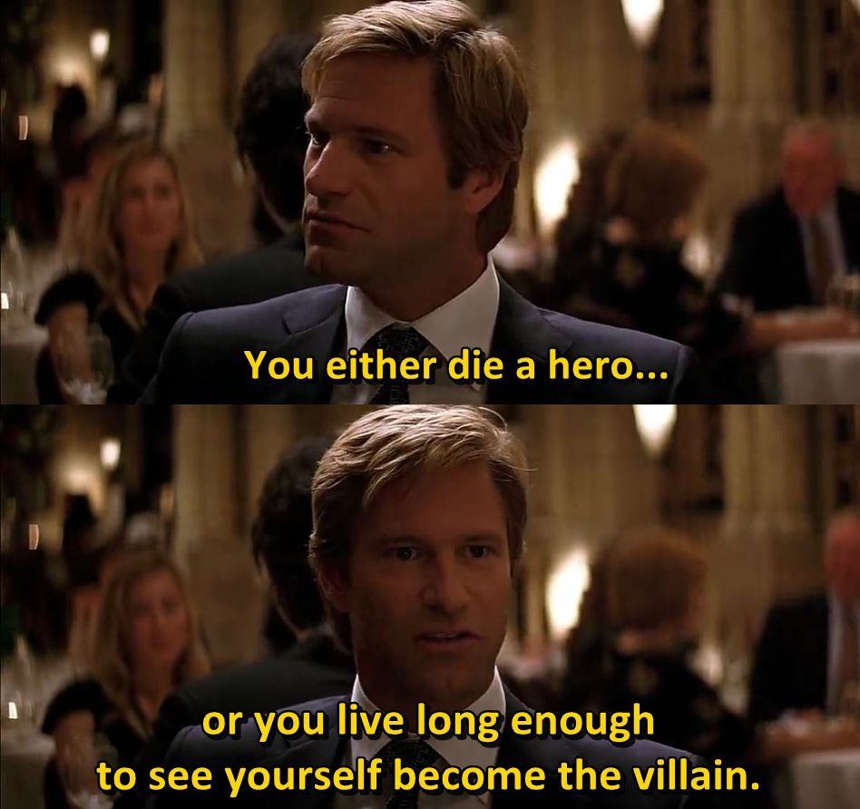

Welcome to journal #2. I failed to write 100 lines of code but experimented with NFT no-code stuff. Going ahead, I need to be strict to reach daily goals.

Watched a video how science journalism hypes things up (all parties are incentivized to do so to get funds/attention/clicks) and sometimes spreads plain misinformation. I think some parallels can be drawn in the web3 space too. A major difference is that hypes in web3 can cause people to lose money in addition to the disappointment.

This begs the following question: if you start posting on social media: Should you exaggerate, pass definitive verdicts, and urge people to action or should you remain agnostic while appreciating your opinions/findings? In other words, should you hype to gain attention or should you be honest? I think I'll choose the latter until I find a strong argument against it.

Or maybe its a slow process; any unbiased person gradually transitions to someone who strongly defends their opinion (sometimes by attacking others) once they start posting,

