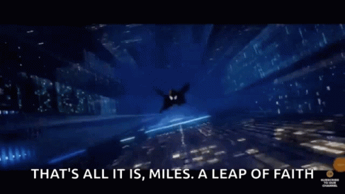

Got distracted on 19th, wasted majority of the day and skipped writing the journal. Had a phone call regarding career opportunity, but the opportunity didn't align with my goals. Skipped excercising.

Today I should have done more; got distracted by youtube primarily. Skipped cooking a meal too. Practiced around 2 hours solo on basketball court.

What's a better career decision? Focus on finding a job quick to ensure stability or take a leap of faith, develop skills which may or may not pay off, not have a source of income for a few months to potentially get a better job risking the possibility of having a career gap in resume and being worse off than the safe option. My friend thinks of the former being the best option, to at least cover my rents by working part-time. I feel the latter is better. This is the age where I can take risks. If I fail taking risks now and go for the safe path, I will probably do that my entire life. I have made up my mind that it would be ok even if I'm slightly worse off. I don't know what I'll do if the negative effects are drastic. But my bigger concern is, will I remain disciplined enough to upskill and use the extra time I'm getting? No one is forcing me and I can only count on motivation and discipline, which I seem to lack.

For now, I'll take the leap of faith.

