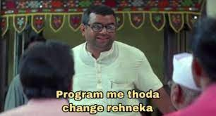

Given how unsuccessful I was in implementing my plan, I need to re-evaluate what I'm doing wrong. I'll quote myself from the first journal:

> 1) No Insta/FB/etc. 2) Cook at least one meal 3) Code at least 100 lines of code and 4) Some physical activity. I also want to use Twitter more, maintain good sleep hygiene and finish reading one paper a day.

The only challenges I was successful at were *1) No Insta/FB/etc.* and *use Twitter more*. Going forward, I don't think these should be an issue. In fact, I could spend less time on Twitter.

It didn't take me long to figure out that *2) Cook at least one meal* and, to some extent, *4) Some physical activity* were unrealistic. I just have 24 hours in a day. Spending 2+ hours on food and 2+ hours on sports together is unrealistic. These activities also tire you out, reducing your productivity and prompting you to take rest. Given my situation, productivity has to be prioritized more.

I failed terribly at *3) Code at least 100 lines of code*, *maintain good sleep hygiene* and *finish reading one paper a day*. From my preparation perspective, these seem to be the important stuff that I can't afford to fail at. Also, **I didn't maintain the journal everyday**.

From January 3 to January 15, I update the challenge to the following check-boxes:
- [x] Write a Journal entry everyday
- [x] Maintain a good sleep hygiene (sleep between 11 pm to 12 am)
- [x] No Insta/FB/etc. Limited time (if any) on Twitter
- [x] Code at least 100 lines of code
- [x] Research a topic/Apply to 3+ jobs for the day

I leave cooking and sports dependent on external factors and as per my mood that day. Of course a few meals and a bare minimum of physical activity a week is mandatory, but I think I'll comfortably achieve it. I have also noticed the following correlation: Using phone as soon as I wake up leads to a very less productive day. Being disciplined even while waking up could help.

>  “Without commitment, you'll never start. But more importantly, without consistency, you'll never finish.” ~ Denzel Washington

I definitely need to be consistent and persevere more. Wishing myself luck for round 2 of trying to be disciplined.

