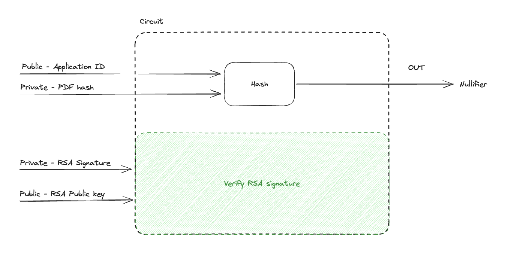
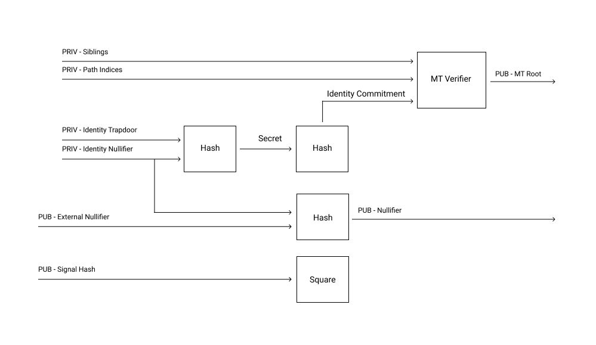

> At the time of writing this post, a new version of AnonAadhaar was already in the works. Once that's released, this attack shouldn't be possible as I have notified the team of this security issue.

In this blog post, I try to explain how the current architecture of AnonAadhaar is susceptible to deanonymization and impersonation attacks. Deanonymization attack was discovered while I was hacking at EthIndia 2023, where I demonstrated how to get around the security loop hole. I won the second prize by Ethereum Foundation for this work. Github link: https://github.com/Y5Yash/zk_cube_voting.

For ease of exposition, I consider a specific use case of AnonAadhaar - government elections/referendum, i.e. voting in which a voter's vote is sensitive and should remain private forever. 

### End-to-End Verifiable voting
Before I describe the attack, I'd like to discuss some desired properties of a voting system. Feel free to skip this section if you are only interested to understand the attack. According to [Wikipedia](https://en.wikipedia.org/wiki/End-to-end_auditable_voting_systems),
> End-to-end auditable or end-to-end voter verifiable (E2E) systems are voting systems with stringent integrity properties and strong tamper resistance.

The following are some of the desirable properties of an E2E voting system:
 1. Individual Verifiability - each voter can check that her ballot was tallied
 2. Universal Verifiability - anyone can check that the result corresponds to all published ballots
 3. Eligibility Verifiability - anyone can check that ballots come only from eligible voters
 4. Secrecy - no one should be able to determine how any individual voted
 5. Non-coercibility - Voters should not be able to prove how they voted; otherwise, they are able to sell their votes, or they may become victims of extortions.

A more complete list of desirable properties in elections can be found [here](https://www.cs.cornell.edu/courses/cs513/2002SP/proj.00.StuSolns/sp2580.htm)

I will show how a voting application using just AnonAadhaar satisfies properties 1,2 and 3 but fails to ensure properties 4 and 5. The proposed solution using [Semaphore Protocol](https://semaphore.pse.dev/) ensures forward secrecy, but only ensures non-coercibility under certain conditions.

# Pre-requisites

### How Anon Aadhaar Works

AnonAadhaar allows users to produce a zero-knowledge-proof of unique Aadhaar ownership. The Government of India signs the Aadhaar PDF hash using their RSA private key to allow verifying the validity of an Aadhaar PDF. We'll assume that the PDF downloaded from government's website is always the same (it's not the same; the timestamps are different and thus hashes are different too). A proof generation circuit takes PDF hash and RSA signature as private inputs and government's RSA public key and application id as public inputs. The RSA signature and RSA public key are used to verify signature to ensure the legitimacy of an Aadhaar PDF. The application id and PDF hash are hashed together to output a nullifier. The purpose of the nullifier is track interaction of a user on the application (e.g. to allow someone to vote only once). The application id (supposed to be unique for each application) is to ensure different nullifier for different applications.

Checkout AnonAadhaar's [Github](https://github.com/privacy-scaling-explorations/anon-aadhaar) and [Documentation](https://anon-aadhaar-documentation.vercel.app/) for full details and updates.

### Semaphore Protocol

Using Semaphore Protocol users can register for an application and then anonymously signal without linking their identity to the signal. This is achieved by registering users as leafs on a Merkle Tree (MT) using hash of two secret values: 1) identity trapdoor and 2) identity nullifier. While signalling, the user generates a zero-knowledge-proof using Merkle path of their leaf with a specific MT root and reproducing the hash of secret values. The identity nullifier is hashed with external nullifier to get a nullifier which is used to prevent double signalling. As the zkp and the nullifier reveal nothing about the identity and the Merkle path, the identity is not revealed. Other details and a better explanation about the protocol can be found at [Semaphore's website](https://semaphore.pse.dev/).

# Deanonymizing a voter

The main intuition of the attack is that the PDF hash remains the same for the user and if the application id is also kept the same during two proof generations, the output nullifier will be the same. If the offchain identity of the person is revealed in one of the 

### Step 1 - Sensitive Voting

Let's say the application id (app_id) of the sensitive voting application is *A*, PDF hash for person *P* is *H* and the corresponding nullifier is *N_a*. Person *P*'s hash remains the same always, so as long as the app_id is different across different applications, the nullifier's will be different. The voting dApp has a smart contract with the following inputs (there are few extra inputs which are not relevant here):
 - *N_a*
 - groth16 (zkp) proof
 - vote *V_p*

The smart contract verifies whether the proof is valid using *A* (hard coded in the contract) and *N_a* by calling the verifier contract. If the proof is valid, the nullifier is nullified (i.e. marked as voted) and the vote is included in the tally. A user can't vote twice because their nullifer will be the same even if they produce a new proof. Hence, only one vote per Aadhaar PDF is possible - ensuring eligibility verifiability. As *P* signs the transaction themselves, individual verifiability is ensured. Universal verifiability can be ensured by keeping the vote counts public in the contract.

### Step 2 - Malicious dApp linking offchain identity

If an attacker makes a new application with the same app_id *A*, the nullifier produced for person *P* will be the same, i.e., *N*. The malicious dApp can have an innocent functionality, e.g. giving feedback using Anon Aadhaar to get freebies and posting a selfie on Twitter. We see a lot of hackathon participants flock to earn free merchandise, often giving away their private data without thinking twice. Thus, *P*'s nullifier *N_a* is linked to their offchain identity.
All voting transactions can be looked up to find out which one has nullifier *N = N_a* and once the transaction is identified, the person's vote *V_p* is revealed.
Thus, secrecy is not guaranteed. Also, by revealing their Aadhaar PDF hash (which they can't forget as the PDF can be redownloaded) they can produce proofs of who they voted for, i.e. get coerced.

# Impersonation Attack

If the same attack as above is done in the opposite order, the attacker can vote on *P*'s behalf too. Here's how this would work:
 - Figure out the app_id *A* of the sensitive voting application
 - Build the malicious dApp and get users' nullifiers before they vote on the voting application
 - Using their proof and *N_a*, vote on the sensitive application

This attack doesn't ensure eligibility verifiability together with not being secure and non-coercive. Note that this need not be restricted to smart contracts, Anon Aadhaar is designed to be used for off-chain applications too.

# Mitigating these Attacks

### Mitigating Impersonation Attack

Impersonation Attack (arguably a more serious attack) on chain can be mitigated by the following updates to the protocol:
 - Add wallet address as a public input and find dummy square in the RSA signature verifying circuit.
 - While verifying the proof, use the transaction's *msg.sender* as the wallet address public input.

As the proof produced now has the address as an input, only the address owner can sign the transaction. Thus, the proof can't be reused elsewhere, ensuring eligibility verifiability. Forward secrecy is still not guaranteed. As forward secrecy is not guaranteed, neither is non-coercion.

### Mitigating Deanonymization Attack

If the nullifier and vote can be linked easily, deanonymization is always possible. The intuition to avoid this is to decouple the registration (prove and produce nullifier) step from the voting step in such a way they can't be linked. The solution I proposed in EthIndia 2023 was to use Semaphore Protocol. As mentioned [above](#semaphore-protocol), Semaphore allows for anonymous signalling following the registration step. Thus, despite knowing a user's nullifier, their vote cannot be found out. All that an attacker can know is if the user register or not. Note that the attacker can't even find if the user vote or not. Thus, forward secrecy is now ensured (Note that eligibility verification is still not ensured, impersonation attack is possible with semaphore solution).

Mitigating non-coercion is also non-trivial. One solution to it would be to ask users to forget their identity trapdoor and identity nullifier as soon as they vote. This can be inconvenient in some cases.[^1]

### Stopping both attacks

To secure Anon Aadhaar, both the solutions have to be used together. One is a protocol level change, while the other is an application level change. Other solutions might exist. I would be really happy to hear new solutions and feedback/criticism/corrections to this post.\
\
\
\
___

[^1]: I wish I could write more about coercion. I do not have any elegant solution other than the one I have mentioned, but I do have some candidate thoughts - 1) bring in plausible deniability (no idea how that's possible), 2) ability to produce false proofs (which doesn't seem coherent with individual verifications).